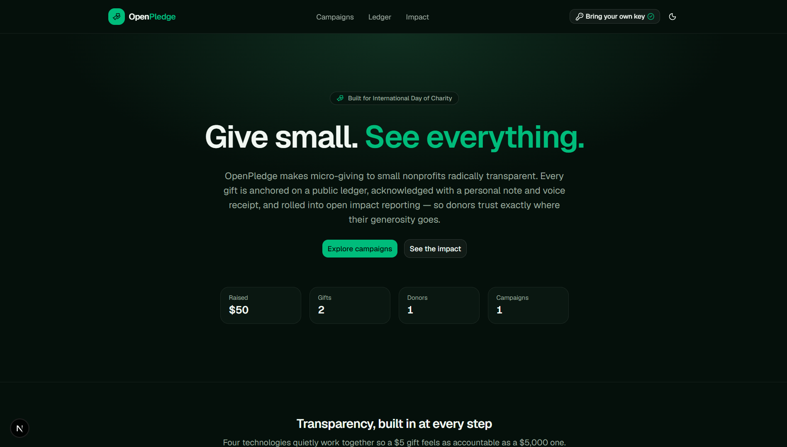
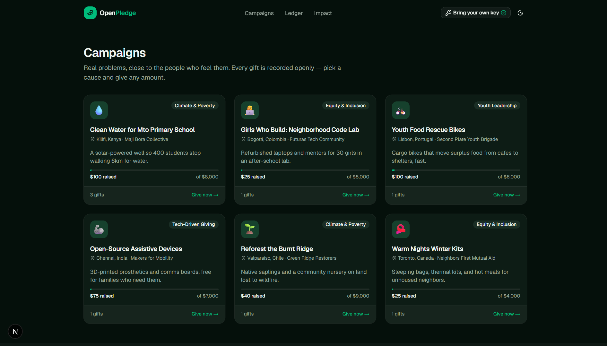
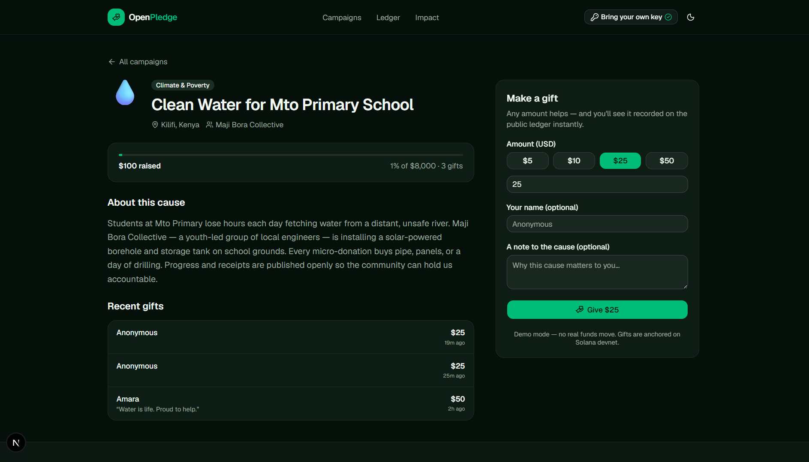
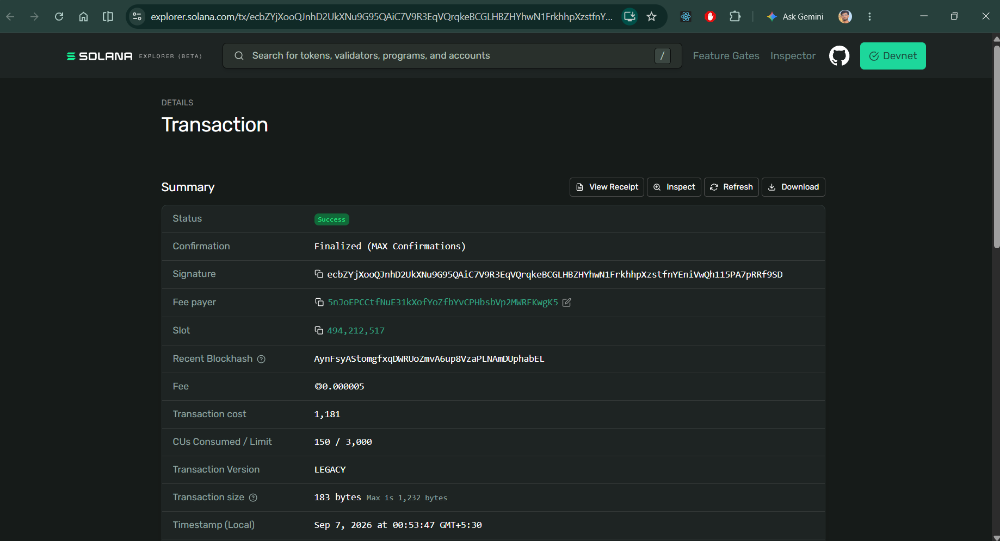

# OpenPledge — Give small. See everything. 🤲

A **transparent micro-donation platform** for small nonprofits, built for the
[DEV Weekend Challenge: Generosity Edition](https://dev.to/challenges/weekend-2026-09-03).

Most giving platforms ask you to trust them. OpenPledge is built so you don't
have to: every micro-donation is **anchored on a public blockchain ledger**,
**acknowledged with a personal AI-written thank-you note and a voice receipt**,
and **rolled into open, aggregate impact reporting** — so a $5 gift is as
accountable as a $5,000 one.

> Built in the spirit of generosity, and around the four themes the UN
> highlights: technology-driven giving, youth leadership, equity & inclusion,
> and climate & poverty.

**🔗 Live app:** [open-pledge.vercel.app](https://open-pledge.vercel.app/) ·
**💻 Repo:** [github.com/sanjaysah101/open-pledge](https://github.com/sanjaysah101/open-pledge)

---

## 📸 Screenshots

|  |  |
| --- | --- |
| **Home** — "Give small. See everything." | **Browse causes** |
|  |  |
| **Give & get an instant receipt** | **Proof on Solana Explorer** |
|  |  |

---

## ✨ What it does

- **Browse campaigns** from small, community-led nonprofits — each mapped to a
  real charity theme (clean water, a girls' code lab, youth food rescue,
  open-source assistive devices, reforestation, winter kits for unhoused
  neighbors).
- **Give any amount.** The moment you do, a four-technology pipeline runs:
  1. 🪙 **Solana** anchors the gift on a public, auditable ledger.
  2. 🤖 **Google Gemini** writes a warm, specific thank-you note.
  3. 🔊 **ElevenLabs** narrates that note into a natural-sounding voice receipt.
  4. ❄️ **Snowflake** mirrors the record for transparent aggregate analytics.
- **Public ledger** — every donation listed openly with its on-chain signature,
  linkable to a Solana explorer. No login required.
- **Impact dashboard** — collective totals, giving by theme, and a daily trend,
  with a Gemini-written impact summary.

## 🏆 Prize-category technologies

| Technology | How it's used |
| --- | --- |
| **Solana** | Each donation is anchored on devnet with a verifiable signature (`src/lib/integrations/solana.ts`). |
| **Google AI (Gemini)** | Personal thank-you notes + the impact-dashboard summary (`src/lib/integrations/gemini.ts`). |
| **ElevenLabs** | Text-to-speech voice receipts streamed on demand (`src/lib/integrations/elevenlabs.ts`, `/api/voice/[id]`). |
| **Snowflake** | Donation warehouse + aggregate impact queries (`src/lib/integrations/snowflake.ts`). |

Every integration **degrades gracefully**: with no API keys the app runs in a
fully-featured demo mode (simulated ledger, template thank-you, locally-computed
analytics), and honestly labels which path produced each result.

## 🧱 Tech stack

- **Bun** + **Next.js 16** (App Router, React Compiler, Turbopack)
- **React 19**, **Tailwind CSS v4** (CSS-first), **shadcn/ui** on **Base UI**
- **Biome** for lint/format
- Scaffolded with [`create-notils`](https://www.npmjs.com/package/create-notils)

## 🚀 Getting started

```sh
bun install
bun run dev
```

Open http://localhost:3000. It works immediately in demo mode — no keys needed.

### Enabling the real integrations

Copy `.env.example` to `.env.local` and fill in the keys you have. Any subset
works; each integration lights up independently.

```sh
cp .env.example .env.local
```

| Variable | Enables |
| --- | --- |
| `GEMINI_API_KEY` | Live Gemini thank-you notes & summaries |
| `ELEVENLABS_API_KEY` | Live voice receipts |
| `SOLANA_TREASURY_SECRET` | Live devnet transactions (funded keypair, JSON byte array) |
| `SNOWFLAKE_ACCOUNT` / `_USERNAME` / `_PASSWORD` | Live warehouse analytics |

## 🗺️ Project structure

```
src/
├── app/
│   ├── page.tsx               # Landing page + live stats
│   ├── campaigns/             # Campaign list + detail (with donate flow)
│   ├── ledger/                # Public transparency ledger
│   ├── impact/                # Snowflake-backed impact dashboard
│   └── api/
│       ├── donate/route.ts    # The 4-tech donation pipeline
│       └── voice/[id]/route.ts# ElevenLabs voice receipt stream
├── components/                # Site chrome + donate panel + voice receipt
└── lib/
    ├── donations/             # Domain types, seed campaigns, store, queries
    └── integrations/          # solana · gemini · elevenlabs · snowflake
```

## ✅ Quality gate

```sh
bun run lint
bun run typecheck
bun run build
```

## 📝 Notes

- **Demo mode by design.** No real funds ever move — the on-chain footprint is a
  symbolic anchor, not custody of money. This keeps the demo safe while proving
  the transparency model.
- In-memory ledger state resets when the server restarts (a stand-in for a real
  database).
- Built entirely within the challenge window.

## License

ISC
